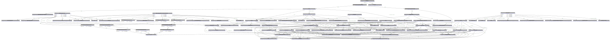

# Tools for composable robot models
This repository contains tools for transforming composable robot models.

## Installation

The common requirements include:

* [Python 3](https://www.python.org/)
* [RDFlib](https://rdflib.dev/)
* [GNU Make](https://www.gnu.org/software/make/)

For the visualizer the following requirements must be satisfied:

* [Graphviz](https://graphviz.org/)

The code generator requires:

* [Jinja](https://palletsprojects.com/p/jinja/)
* [OROCOS KDL](https://www.orocos.org/kdl.html)

## Getting started
Check out this repository and the repository for the
[modelling tutorial](https://github.com/comp-rob2b/modelling-tutorial) 
on composable models to the same directory.

### Using the visualizer
The visualizer first performs a model-to-model transformation from the
composable models to a DOT graph description model. Execute this transformation
by running the following command in this repository:
```BASH
python visualizer.py
```

Afterwards a `model.dot` file should have been generated that can simply be
converted to a PDF, PNG and SVG file by executing the `Makefile`:
```BASH
make
```

This will produce a similar output to what is shown in the following Figure 1.

|        |
|:--------------------------------------:|
| Figure 1: Possible model visualization |


### Using the code generator
To use the code generator first run the following command:
```BASH
python code_generator.py
```

The output will be created in the `gen/` directory. Thus, change into that
directory and execute the `Makefile` to compile the generated KDL code:
```BASH
make
```

This will produce an executable which can be run by
```BASH
./kdl_gen
```

For the tutorial setup it will simply print the specified and computed
kinematics as shown similar to the following output:
```
  pose_link1_joint1_wrt_link1_root: 
  [[           0,           0,           1;
               0,           1,           0;
               1,           0,           0]
  [            1,           2,           3]]
  pose_link2_root_wrt_link1_joint1: 
  [[   -0.416147,   -0.909297,           0;
        0.909297,   -0.416147,           0;
               0,           0,           1]
  [            0,           0,           0]]
  pose_link2_root_wrt_link1_root: 
  [[           0,           0,           1;
        0.909297,   -0.416147,           0;
       -0.416147,   -0.909297,           0]
  [            1,           2,           3]]
```

For each of the three poses the first 3x3 values represent the orientation
matrix while the last three values represent the position vector.

## Publication

If you use our work please cite the following paper:

> Domain-specific languages for kinematic chains and their solver algorithms: lessons learned for composable models
> Sven Schneider and Nico Hochgeschwender and Herman Bruyninckx
> International Conference on Robotics and Automation (ICRA). 2023.  

## Acknowledgement
This work is part of a project that has received funding from the European
Union's Horizon 2020 research and innovation programme SESAME under grant
agreement No 101017258.

<p align="center">
  
  
</p>
